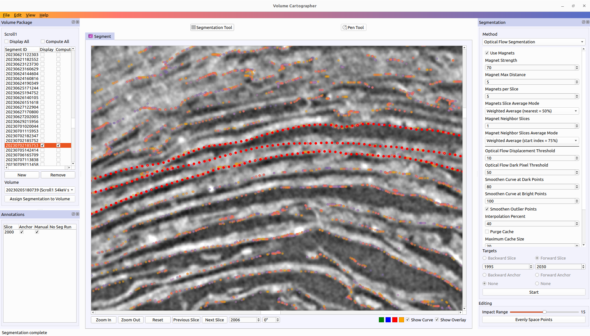

# Point Cloud Overlays & OFS Magnets

VC now supports to load and display PLY and OBJ point clouds, plus utilize them as segmentation magnets during OFS segmentation runs. This document outlines its usage and parameters.



## Point cloud loading and rendering
1.	Enabled the VC core logic to not only read ASCII PLY files, but also binary ones (not only for VC GUI but should work for all tools), as that is what Thaumato is outputting.

2.	A point cloud can be loaded via the "File" menu entry "Add overlay folder". A folder selection dialog will appear where you have to select the folder that contains the point cloud data. Two variants are currently supported:
    * A folder that contains the cell_yxz_*.ply files from Thaumato (before instance segmentation)
    * A folder with subfolders containing Thaumato instance segmentation layer files (e.g. from https://dl.ash2txt.org/full-scrolls/Scroll1/PHercParis4.volpkg/scroll1_surface_points/point_cloud_colorized_verso_subvolume_blocks/). Note that you need to unpack those TAR files first, VC will not do that on the fly.
    * For both variants, the chunk files are read dynamically from the selected folder as required based on the shown scroll portion in the viewer window. 

__Note__: Loading a single, individual PLY/OBJ file as an overlay point cloud is also not supported yet, but will be added as well.

3.	Once you selected a point cloud folder, you will see a popup to input the information about scaling, offset, axis, ... In the dropdown at the top you can select what data variant you selected. The fields will then get pre-filled with values matching the default Thaumato output.

4.	Once a point cloud was successfully loaded, its points will be overlayed on top of the slice images. You can toggle the rendering on/off via the checkbox below the viewer (next to the existing “Show Curve” checkbox) and also via the new keyboard shortcut “B”.

5.	There is no support yet for changing overlay user settings via the GUI, so for now that has to be manually done in the `VC.ini` file.
    * Everything in a new setting section `[overlay]`
    * `display_neighbor_slices`: Default = 1, means VC will not only render the points for the currently viewed slice, but also the ones from the slice above and below. The coloring matches the gradient from the VC header bar. Points from current slice are orange, the ones below go towards yellow, the ones above towards purple/blue. Valid values are 0 (no neighbor slices used), 1 or 2.
```
[overlay]
display_neighbor_slices=1
```

__Note:__ The first 5 slices from https://dl.ash2txt.org/full-scrolls/Scroll1/PHercParis4.volpkg/scroll1_surface_points/point_cloud_colorized_verso_subvolume_blocks/ are wrong and should be ignored for now.

## Use point cloud as magnets in OFS segmentation

If a point cloud is loaded, it can be used as an addition to the OFS algorithm to better guide it through the scrolls. This allows longer segmentation runs while keeping the curves on the papyrus. The point cloud points serve as magnets to pull on the OFS output points.

Corresponding new parameters have been added to the OFS segmentation panel:
1. `Use Magnets`: Toggles the magnet logic on/off
2. `Magnet Strength`: Strength with which the magnets pull the OFS points towards them. 70 means, that the OFS point will be pulled 70% of the distance delta between magnet and OFS point.
3. `Magnet Max Distance`: How far a potential magnet point may be away from the OFS point, in order to be relevant for pulling.
4. `Magnets per Slice`: How many magnets will be considered per slice.
5. `Magnets Slice Average Mode`: Determines how the relevant magnets will be combined.
    * Linear Average: Gives the same weight to each magnet
    * Weighted Average: Gives the highest weight to the nearest magnet, and then halves the weight for next magnet and so on. There are two variants, one where the first magnet weight is 50% and one with 75%.
6. `Magnet Neighbor Slices`: How many slices besides the one that OFS is currently being run for, should be used to look for magnets. A value of 1, means that one slice above and one below will be considered, 2 means two slices above and below and so on.
7. `Magnet Neighbor Slices Average Mode`: If neighbor slices are used, then for each slice the magnet determination runs based on the provided parameters. At the end that means for each considered slice we have one magnet point (might be a virtual one if multiple magnets on the slice were averaged together). This parameter controls, how those virtual magnets for each slice will be now averaged to get the final magnet that then actually pulls on the OFS point.
    * Linear Average: Gives the same weight to each magnet
    * Weighted Average: Gives the highest weight to the magnet on the slice OFS is currently running on, then half of that for the direct neighbors (one slice above and below, which means they effectively get a quarter each), then again half to the next further away neighbor pair (so an eight each) and so on
    * Nearest Only. Selects the nearest magnet of all the virtual slice magnets and only uses that one to pull the OFS point
